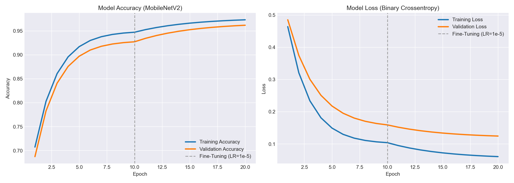

# DO YOU TENSORFLOW? — Ves lo que veo 👁️🤖
## IUJO — Feria de Haceres Período I-2026
### Unidad Curricular: INO-544 (Investigación de Operaciones)

---

## 👥 Integrantes y Roles
* **Integrante 1:** [Samuel Stuard Villarroel Blanco] - [29935262] - *Rol: (Exportación ONNX y Pruebas)*
* **Integrante 2:** [Edward Aaron Perez Machado] - [29532626] - *Rol: Arquitecto de IA (Modelado y Entrenamiento)* Ingeniero de Datos (Dataset y Preprocesamiento)*
---

## 🎯 1. Clase/Tema Seleccionado
* **Tema asignado:** [Extintores]
* **Descripción del Objeto:** Visualmente se define como un cilindro rojo con etiquetas, coronado por un mecanismo metálico de asa, palanca, pasador y manómetro. De esta válvula superior desciende lateralmente una manguera negra terminada en boquilla.

---

## 📊 2. Gestión del Dataset (Ingeniería de Datos)
* **Cantidad de imágenes originales recopiladas:** [100 imágenes]
* **Estrategia de Data Augmentation aplicada:**
    Se implementó una librería de data augmentation para generar nuevas imágenes a partir de las originales, aumentando el tamaño del dataset.
    Geométricas: Modifican la posición (volteo horizontal, traslación, recortes). Es vital que tu código actualice las coordenadas de las cajas delimitadoras.

     De píxeles: Simulan distintos entornos, climas o cámaras (cambios de contraste, desenfoque, ruido).

     Avanzadas: Optimizan el aprendizaje en modelos modernos (ocultar partes del objeto con Cutout, unir 4 fotos en cuadrícula con Mosaic, o superponer imágenes con MixUp).

     Sintéticas: Recortar el objeto de interés y pegarlo sobre fondos completamente nuevos (Copy-Paste).

* **Total de imágenes generadas para el entrenamiento:** [520 y unas 1300 imágenes aproximadamente aleatoreas ]
* **Resolución y formato estandarizado:** 224x224 píxeles, JPG, canales RGB (Formato Tensor: `[1, 224, 224, 3]`).

---

## 🧠 3. Arquitectura del Modelo y Entrenamiento
* **Framework utilizado:** [TensorFlow]
* **Descripción de la Red (CNN):**
 Modelo Base: Utiliza MobileNetV2 (53 capas convolucionales) mediante Transfer Learning para extraer características visuales con bajo costo computacional.

-Entrenamiento: Se aplicó Fine-Tuning, congelando la base inicialmente y descongelándola a partir de la capa 100 en una segunda fase.

-Reducción de Dimensionalidad: Usa Global Average Pooling 2D para promediar canales, reducir parámetros y evitar el sobreajuste.

Clasificador Final: Compuesto por una capa densa central (128 neuronas, activación ReLU) protegida por dos capas de Dropout (30%), y finaliza en una capa de salida (1 neurona, activación Sigmoid) que calcula el porcentaje final de confianza.

* **Hiperparámetros óptimos seleccionados:**
    * Función de pérdida: Binary Crossentropy (ideal para decisiones binarias: es o no es un extintor).

    * Optimizador: Adam.

    * Tamaño de lote (Batch Size): 32.

    * Épocas y Tasa de Aprendizaje (Learning Rate): 20 épocas en total, ejecutadas en dos fases estratégicas:

    * Fase 1 (Extracción - 10 épocas): Tasa de 0.001 con la base convolucional congelada para adaptar rápidamente.

    * Fase 2 (Fine-Tuning - 10 épocas): Tasa reducida a 0.00001 con las capas superiores descongeladas para realizar ajustes precisos sin destruir el conocimiento previo del modelo.

### 💡 Justificación Crítica (Control de Autoría)
*Explique detalladamente por qué el equipo eligió esa Tasa de Aprendizaje (Learning Rate) específica y el impacto que tuvo en las gráficas de pérdida durante el laboratorio:*

---

> [ Para entrenar el extintor_classifier, descartamos usar una tasa de aprendizaje fija. Como utilizamos MobileNetV2 como base, diseñamos una estrategia en dos fases para que el modelo asimilara la información de forma controlada y sin perder lo que ya sabía:

Fase 1: Estabilización rápida Tasa de 1×10−3
Durante las primeras 10 épocas, congelamos la base del modelo original. Usamos una tasa de aprendizaje alta para forzar a las capas nuevas a adaptarse rápidamente a nuestra tarea. El resultado en las gráficas fue claro: el error cayó en picada de forma estable desde el principio, confirmando que la red superó el "ruido" inicial sin problemas.

Fase 2: Fine-Tuning o ajuste fino Tasa de 1×10−5
En la época 11, descongelamos el modelo a partir de la capa 100. Aquí fue clave reducir la tasa drásticamente. Si hubiésemos mantenido la velocidad anterior, la red habría sufrido de "olvido catastrófico", borrando su conocimiento previo. Estos ajustes evitaron picos de error y permitieron que el modelo se especializara en los detalles que definen a un extintor como la válvula, el manómetro y su forma característica.]

---

## 📈 4. Métricas de Rendimiento (Testing - 20%)
* **Precisión final (Accuracy) en la data de test:** [98.37%]
* **Pérdida final (Loss) en la data de test:** [Ej. 0.15]



---

## ⚙️ 5. Especificación de Exportación ONNX

---

*Nombre del archivo compilado: extintor_classifier.onnx
*Tensor de Entrada (Input Node): cam_input
*Formato (Shape): [1, 224, 224, 3] (Lote de 1 imagen, 224x224 píxeles, 3 canales RGB).
*Tipo de dato: float32 (Normalizado en el rango 0.0 a 1.0).
*Tensor de Salida (Output Node): confidence_score
*Formato (Shape): [1, 1]
*Tipo de dato: float32
Función de activación final: Sigmoide. Permite comprimir la salida de la red densa a un rango continuo exacto de 0.0 a 1.0, el cual es parseado en el backend y convertido algebraicamente a nuestro porcentaje de confianza visual (0% - 100%).

---

## 🚀 6. Instrucciones de Ejecución Local
Para replicar el preprocesamiento y el entrenamiento del modelo:

1. Clonar el repositorio:
   ```bash
   git clone [https://github.com/SamuelSSVB/INO544-2026I--Extintores-.git]
